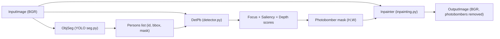

## Photobomber Removal Pipeline

This project detects and removes photobombers from an image using person segmentation, focus/saliency/depth analysis, and image inpainting.

### Flow



### Installation

1. Install dependencies:
```bash
pip install -r requirements.txt
```

2. Download YOLO segmentation model weights (if not already present):
   - The pipeline will automatically download `yolo11l-seg.pt` on first use, or you can specify a custom path with `--seg_model`.

### Detection Paradigms

The pipeline uses three complementary detection methods:

1. **Focus/Blur Detection** (Always enabled)
   - Uses multi-metric approach: Laplacian variance, Sobel gradient magnitude, and edge density
   - Supports both relative and absolute thresholds
   - Blurred persons are always classified as photobombers

2. **Saliency Detection** (Optional, enabled with `--saliency`)
   - Identifies less salient persons as potential photobombers
   - Uses Inspyrenet or rembg backend

3. **Depth Detection** (Optional, enabled with `--depth`)
   - Identifies persons at different depth planes
   - Uses Depth-Anything-V2 model

**Default behavior**: Only blur detection is enabled. Use `--saliency` and/or `--depth` to enable additional paradigms.

### Usage

#### Basic Usage

Run the full pipeline with default settings (blur detection only):

```bash
python pipeline.py --input path/to/image.jpg
```

#### Enable Additional Detection Methods

```bash
# Enable saliency detection
python pipeline.py --input image.jpg --saliency

# Enable depth detection
python pipeline.py --input image.jpg --depth

# Enable both saliency and depth
python pipeline.py --input image.jpg --saliency --depth
```

#### Advanced Options

```bash
python pipeline.py \
    --input path/to/image.jpg \
    --output path/to/result.jpg \
    --saliency \
    --depth \
    --focus_thr 0.2 \
    --absolute_focus_thr 200 \
    --saliency_thr 0.5 \
    --depth_thr 0.6 \
    --combined_thr 0.5 \
    --vis \
    --use_diffusion \
    --prompt "a beautiful landscape" \
    --dilate 15
```

### Command-Line Arguments

#### Input/Output
- `--input` (required): Path to input image
- `--output`: Path to save inpainted result (optional, defaults to folder-based naming)
- `--vis`: Save detection visualization overlay
- `--vis_path`: Custom path for visualization (auto-generated if not specified)

#### Detection Paradigms
- `--saliency`: Enable saliency-based detection
- `--depth`: Enable depth-based detection

#### Detection Thresholds
- `--focus_thr`: Relative blur threshold [0, 1] (default: 0.2)
- `--absolute_focus_thr`: Absolute blur threshold (default: None). Typical values: 100-500. If set, uses absolute threshold instead of relative.
- `--saliency_thr`: Saliency threshold [0, 1] (default: 0.5)
- `--depth_thr`: Depth difference threshold [0, 1] (default: 0.6)
- `--combined_thr`: Combined score threshold [0, 1] (default: 0.5)

#### Models
- `--seg_model`: YOLO segmentation model path (default: `yolo11l-seg.pt`)
- `--saliency_backend`: Saliency backend - `inspyrenet` or `rembg` (default: `inspyrenet`)
- `--depth_model`: Depth estimation model (default: `depth-anything/Depth-Anything-V2-Small-hf`)
- `--inpainting_model`: Diffusion inpainting model (default: `runwayml/stable-diffusion-inpainting`)

#### Inpainting
- `--use_diffusion`: Use diffusion inpainting instead of LaMa (default: LaMa)
- `--dilate`: Mask dilation in pixels (default: 15)
- `--prompt`: Inpainting prompt for diffusion mode
- `--negative_prompt`: Negative inpainting prompt for diffusion mode

### Output Organization

All outputs are automatically organized into a folder named after the input image:

```
path/to/
└── image_name/
    ├── segmented.jpg      # Person segmentation overlay
    ├── mask.png          # Photobomber detection mask
    ├── depth.jpg         # Depth map visualization (if --depth enabled)
    ├── saliency.jpg      # Saliency map (if --saliency enabled)
    ├── detection.json    # Detection results metadata
    ├── inpainted.jpg     # Final result with photobombers removed
    └── visualization.jpg # Detection visualization (if --vis enabled)
```

### Detection Logic

1. **Blur-first rule**: If a person is blurred (`focus_score < focus_thr` or `sharpness < absolute_focus_thr`), they are classified as a photobomber regardless of other scores.

2. **Combined scoring**: For non-blurred persons, if saliency and/or depth are enabled:
   - If both enabled: `combined_score = (saliency_score * w_s + depth_score * w_d) / (w_s + w_d)`
   - If only saliency: `combined_score = saliency_score`
   - If only depth: `combined_score = depth_score`
   - If both disabled: person is not a photobomber (unless blurred)

3. **Final classification**: Person is a photobomber if `combined_score < combined_thr`

### Blur Detection Improvements

The blur detection uses a multi-metric approach:
- **Laplacian variance**: Primary metric for edge detection
- **Sobel gradient magnitude**: Complementary edge information
- **Sobel mean**: Robust to high-frequency artifacts (e.g., sunglasses reflections)
- **Edge density**: Canny-based edge count per unit area

Mask erosion is applied to focus on core person regions and avoid background contamination.

### Examples

```bash
# Minimal pipeline (blur detection only)
python pipeline.py --input photo.jpg

# Full pipeline with all detection methods
python pipeline.py --input photo.jpg --saliency --depth --vis

# Use absolute blur threshold for better accuracy
python pipeline.py --input photo.jpg --absolute_focus_thr 200

# Use diffusion inpainting with custom prompt
python pipeline.py --input photo.jpg --use_diffusion --prompt "a serene beach scene"
```

