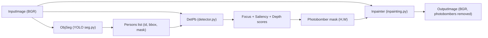

## Photobomber Removal Pipeline

This project detects and removes photobombers from an image using person segmentation, focus/saliency/depth analysis, and image inpainting.

### Flow



### Usage

Run the full pipeline via:

```bash
python pipeline.py --input path/to/image.jpg --output path/to/result.jpg
```

